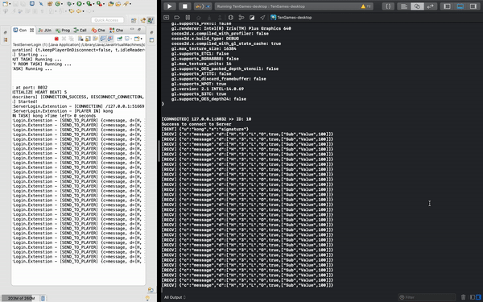

<p align="center">
    <a href="#">
        
    </a>
</p>
<p align="center">
    <a href="https://mvnrepository.com/artifact/io.github.congcoi123/tenio">
        
    </a>
    <a href="https://javadoc.io/doc/io.github.congcoi123/tenio">
        
    </a>
    <a href="LICENSE">
        
    </a>
    <a href="https://travis-ci.org/github/congcoi123/tenio">
        
    </a>    
    <a href="https://coveralls.io/github/congcoi123/tenio">
        
    </a>   
    <a href="#">
        
    </a>
    <a href="https://github.com/congcoi123/tenio/issues">
        
    </a>
    <a href="CONTRIBUTING.md">
        
    </a>
    <a href="https://gitter.im/ten-io/community?source=orgpage">
        
    </a>
</p>

# TenIO [](https://twitter.com/intent/tweet?text=TenIO%20is%20a%20java%20NIO%20based%20server%20specifically%20designed%20for%20multiplayer%20games.%0D%0A&url=https://github.com/congcoi123/tenio%0D%0A&hashtags=tenio,java,gameserver,multiplayer,nio,netty,jetty,msgpack,cocos2dx,unity,libgdx,phaserjs%0D%0A&via=congcoi123)
`TenIO` is a java NIO (Non-blocking I/O) based server specifically designed for multiplayer games. It supports UDP and TCP transports which are handled by [Netty](https://netty.io/) for high-speed network transmission. It uses [MsgPack](https://msgpack.org/index.html) for compressing data so that can be transferred quickly through the network. This framework can help you quickly create a game server or integrate it into your system. It can be used to create scalable, distributed systems (such as MMORPG systems).

## Features
- Scalable, distributed design.
- Easy-to-use, OOP design.
- Based on standard Java development, ensuring cross-platform support.
- Simple event handlers implementation.
- Simple physic simulator and debugger.
- Have simple existing game clients for rapid development.

## Showcases
| [<br /><sub><b>Gold Miner Online</b></sub>](https://www.youtube.com/watch?v=BBv5IQFHLjc)<br />        | [<br /><sub><b>Retro Brick Game Online</b></sub>](https://www.youtube.com/watch?v=nojkJMAfG6Y)<br /> |
| :-----------------------------------------------------------------------------------------------------------------------------------------------------------------: | :-----------------------------------------------------------------------------------------------------------------------------------------------------------------------: |

## Architecture


## First glimpse
- Simple Movement Simulation  

- Communication Simulation  


## Wiki
The [wiki](https://github.com/congcoi123/tenio/wiki) provides implementation level details and answers to general questions that a developer starting to use `TenIO` might have about it.

## Clients
| [<br /><sub><b>TenIO Cocos2dx</b></sub>](https://github.com/congcoi123/tenio-cocos2dx)<br />        | [<br /><sub><b>TenIO Libgdx</b></sub>](https://github.com/congcoi123/tenio-libgdx)<br /> | [<br /><sub><b>TenIO Unity</b></sub>](https://github.com/congcoi123/tenio-unity)<br />          | [<br /><sub><b>TenIO Phaserjs</b></sub>](https://github.com/congcoi123/tenio-phaserjs)<br /> |
| :-----------------------------------------------------------------------------------------------------------------------------------------------------------------: | :-----------------------------------------------------------------------------------------------------------------------------------------------------------------------: | :-------------------------------------------------------------------------------------------------------------------------------------------------------------------: | :-------------------------------------------------------------------------------------------------------------------------------------------------------------: |

## Dependencies
- guava 29.0-jre
- netty-all 4.1.50.Final
- servlet-api 2.5
- log4j-core 2.13.3
- jetty-server 9.4.31.v20200723
- jetty-servlet 9.4.31.v20200723
- msgpack 0.6.12

## Requirements
- Java 11

## License
The `TenIO` project is currently available under the [MIT](LICENSE) License.

## Changelog
Please check out the [changelog](CHANGELOG.md) for more details.

## Contributing
Please check out the [contributing guideline](CONTRIBUTING.md) for more details.

## Documentations
Please check out the [documentations directory](documentations) for more details.

## Installation
For the 3.x version, you can get by Maven
```xml
<dependency>
    <groupId>io.github.congcoi123</groupId>
    <artifactId>tenio</artifactId>
    <version>3.1.1</version>
</dependency>
```
Or you can get the sources
```sh
$ git clone https://github.com/congcoi123/tenio.git
```

## Examples
Please start the server before its corresponding client in each example package.

```txt
|-- example
    |-- example1
    |   |-- TestClientLogin.java
    |   |-- TestServerLogin.java
    |-- example2
    |   |-- TestClientFSM.java
    |   |-- TestFSM.java
    |   |-- TestServerFSM.java
    |-- example3
    |   |-- TestClientAttach.java
    |   |-- TestServerAttach.java
    |-- example4
    |   |-- TestClientMovement.java
    |   |-- TestMovement.java
    |   |-- TestServerMovement.java
    |-- example5
    |   |-- TestECS.java
    |-- example6
    |   |-- TestClientStress.java
    |   |-- TestServerStress.java
    |-- example7
    |   |-- TestServerPhaserjs.java
```

> Happy coding !
