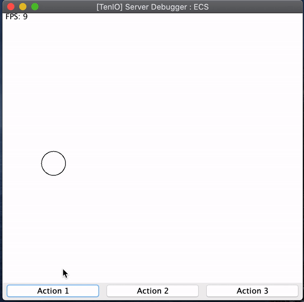

# TenIO
[](https://mvnrepository.com/artifact/io.github.congcoi123/tenio)
[](https://javadoc.io/doc/io.github.congcoi123/tenio)
[](LICENSE)
[](https://travis-ci.org/github/congcoi123/tenio)

TenIO is a java NIO (Non-blocking I/O) based server specifically designed for multiplayer games. It supports UDP and TCP transports which are handled by [Netty](https://netty.io/) for high-speed network transmission. It uses [MsgPack](https://msgpack.org/index.html) for compressing data so that can be transferred quickly through the network. This framework can help you quickly create a game server or integrate it into your system.

## Features
- Easy-to-use, OOP design.
- Based on standard Java development, ensuring cross-platform support.
- Simple event handlers implementation.
- Simple physic simulator and debugger.
- Have simple existing game clients for rapid development.

## First glimpse
- Simple Movement Simulation  

- Communication Simulation  

- Simple ECS (Entity Component System) Simulation  


## Wiki
The [wiki](https://github.com/congcoi123/tenio/wiki) provides implementation level details and answers to general questions that a developer starting to use TenIO might have about it.

### Clients
- [TenIOCocos2dx](https://github.com/congcoi123/tenio-cocos2dx.git)
- [TenIOLibgdx](https://github.com/congcoi123/tenio-libgdx.git)
- [TenIOJs](https://github.com/congcoi123/tenio-js.git)

## Dependencies
- netty-all 4.1.42.Final
- msgpack 0.6.12
- guava 25.1-jre
- log4j-core 2.11.1

## License
The TenIO project is currently available under the [MIT](LICENSE) License.

## Changelog
Please check out the [changelog](CHANGELOG.md) for more details.

## Installation
Maven
```xml
<dependency>
    <groupId>io.github.congcoi123</groupId>
    <artifactId>tenio</artifactId>
    <version><!--see above--></version>
</dependency>
```
Or you can get the sources
```
git clone https://github.com/congcoi123/tenio.git
```

## Examples
Please start the server before its corresponding client in each example package.

```txt
|-- examples
    |-- client
    |   |-- IDatagramListener.java
    |   |-- ISocketListener.java
    |   |-- TCP.java
    |   |-- UDP.java
    |-- example1
    |   |-- PlayerLogin.java
    |   |-- TestClientLogin.java
    |   |-- TestServerLogin.java
    |-- example2
    |   |-- LifeCycle.java
    |   |-- TestClientFSM.java
    |   |-- TestFSM.java
    |   |-- TestServerFSM.java
    |   |-- constants
    |   |   |-- EntityName.java
    |   |   |-- Location.java
    |   |   |-- MessageType.java
    |   |-- entities
    |   |   |-- BaseEntity.java
    |   |   |-- Inspector.java
    |   |   |-- Miner.java
    |   |   |-- Wife.java
    |   |-- state
    |       |-- miner
    |       |   |-- EatStew.java
    |       |   |-- EnterMineAndDigForNugget.java
    |       |   |-- GoHomeAndSleepTilRested.java
    |       |   |-- QuenchThirsty.java
    |       |   |-- VisitBankAndDepositGold.java
    |       |-- wife
    |           |-- CookStew.java
    |           |-- DoHouseWork.java
    |           |-- VisitBathroom.java
    |           |-- WifesGlobalState.java
    |-- example3
    |   |-- PlayerAttach.java
    |   |-- TestClientAttach.java
    |   |-- TestServerAttach.java
    |-- example4
    |   |-- TestClientMovement.java
    |   |-- TestMovement.java
    |   |-- TestServerMovement.java
    |   |-- World.java
    |   |-- behavior
    |   |   |-- SteeringBehavior.java
    |   |-- configuration
    |   |   |-- FileLoaderBase.java
    |   |   |-- ParamLoader.java
    |   |   |-- params.ini
    |   |-- constants
    |   |   |-- Behavior.java
    |   |   |-- Constants.java
    |   |   |-- Deceleration.java
    |   |   |-- SummingMethod.java
    |   |-- entities
    |       |-- Inspector.java
    |       |-- Obstacle.java
    |       |-- Vehicle.java
    |       |-- Wall.java
    |-- example5
    |   |-- ECS.java
    |   |-- TestECS.java
    |   |-- components
    |   |   |-- Animation.java
    |   |   |-- Motion.java
    |   |   |-- Position.java
    |   |   |-- View.java
    |   |-- constants
    |   |   |-- Constants.java
    |   |-- context
    |   |   |-- GameComponents.java
    |   |   |-- GameContext.java
    |   |   |-- GameEntity.java
    |   |-- systems
    |       |-- InitializeSystem.java
    |       |-- MoveSystem.java
    |       |-- RenderSystem.java
    |       |-- TeardownSystem.java
    |-- example6
    |   |-- PlayerStress.java
    |   |-- TestClientStress.java
    |   |-- TestServerStress.java
    |-- server
        |-- Configuration.java
```

> Happy coding !
