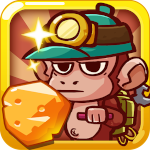
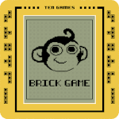
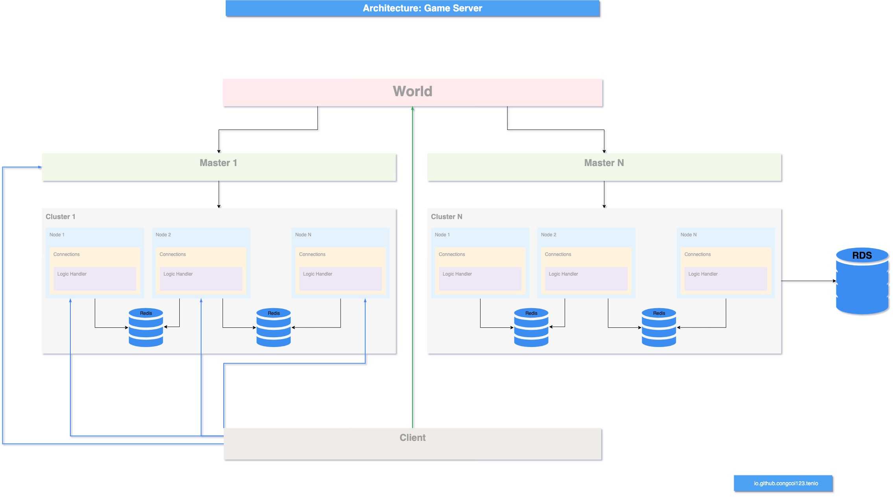
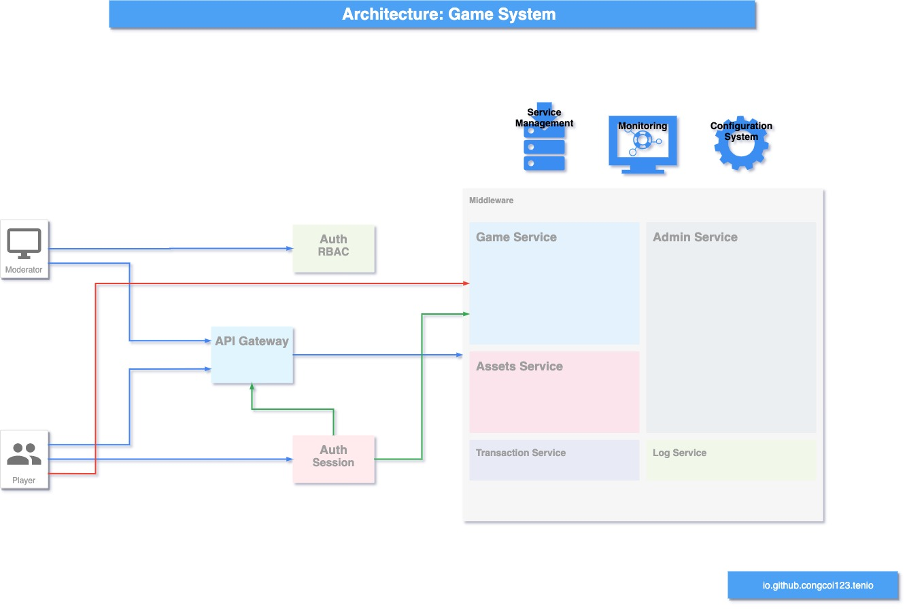
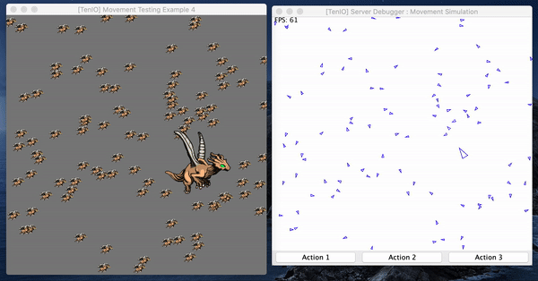
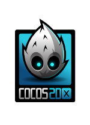
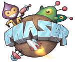

<p align="center">
    <a href="#">
        
    </a>
</p>
<p align="center">
    <a href="https://mvnrepository.com/artifact/io.github.congcoi123/tenio">
        
    </a>
    <a href="https://javadoc.io/doc/io.github.congcoi123/tenio">
        
    </a>
    <a href="LICENSE">
        
    </a>
    <a href="https://travis-ci.org/github/congcoi123/tenio">
        
    </a>    
    <a href="https://coveralls.io/github/congcoi123/tenio">
        
    </a>   
    <a href="#">
        
    </a>
    <a href="https://github.com/congcoi123/tenio/issues">
        
    </a>
    <a href="CONTRIBUTING.md">
        
    </a>
    <a href="https://gitter.im/ten-io/community?source=orgpage">
        
    </a>
</p>

# TenIO [](https://twitter.com/intent/tweet?text=TenIO%20is%20a%20java%20NIO%20based%20server%20specifically%20designed%20for%20multiplayer%20games.%0D%0A&url=https://github.com/congcoi123/tenio%0D%0A&hashtags=tenio,java,gameserver,multiplayer,nio,netty,jetty,msgpack,cocos2dx,unity,libgdx,phaserjs%0D%0A&via=congcoi123)
`TenIO` is an open-source project to create multiplayer online games that includes a java NIO (Non-blocking I/O) based server specifically designed for multiplayer games, which supports UDP, TCP, Websocket, HTTP transports, and available simple client projects for quick development.

## Features
- Scalable, distributed design
- Easy-to-use, OOP design
- Based on standard Java development, ensuring cross-platform support
- Simple event handlers implementation
- Simple physic simulator and debugger
- Have simple existing game clients for rapid development

## Showcases
| [<br /><sub><b>Gold Miner Online</b></sub>](https://www.youtube.com/watch?v=BBv5IQFHLjc)<br />        | [<br /><sub><b>Retro Brick Game Online</b></sub>](https://www.youtube.com/watch?v=nojkJMAfG6Y)<br /> |
| :-----------------------------------------------------------------------------------------------------------------------------------------------------------------: | :-----------------------------------------------------------------------------------------------------------------------------------------------------------------------: |

## MMOG System Architecture




## First Glimpse
- Simple Movement Simulation  


## Simple Implementation
```Java
@Bootstrap
public final class TestServerLogin {

    public static void main(String[] params) {
        ApplicationLauncher.run(TestServerLogin.class, params);
    }

}

@Component
public final class ConnectionEstablishedHandler extends AbstractExtension implements EventConnectionEstablishedResult {

    @Override
    public void handle(Session session, ServerMessage message, ConnectionEstablishedResult result) {
        if (result == ConnectionEstablishedResult.SUCCESS) {
            var data = (ZeroObject) message.getData();

            api().login(data.getString(SharedEventKey.KEY_PLAYER_LOGIN), session);
        }
    }

}

@Component
public final class PlayerLoggedinHandler extends AbstractExtension implements EventPlayerLoggedinResult {

    @Override
    public void handle(Player player, PlayerLoggedinResult result) {
        if (result == PlayerLoggedinResult.SUCCESS) {
            var data = object().putString(SharedEventKey.KEY_PLAYER_LOGIN,
                    String.format("Welcome to server: %s", player.getName()));

            response().setContent(data.toBinary()).setRecipient(player).write();
        }
    }

}

@Component
public final class ReceivedMessageFromPlayerHandler extends AbstractExtension
        implements EventReceivedMessageFromPlayer {

    @Override
    public void handle(Player player, ServerMessage message) {
        var data = object().putString(SharedEventKey.KEY_CLIENT_SERVER_ECHO, String.format("Echo(%s): %s",
                player.getName(), ((ZeroObject) message.getData()).getString(SharedEventKey.KEY_CLIENT_SERVER_ECHO)));

        response().setContent(data.toBinary()).setRecipient(player).write();
    }

}
```

## Wiki
The [wiki](https://github.com/congcoi123/tenio/wiki) provides implementation level details and answers to general questions that a developer starting to use `TenIO` might have about it.

## Clients
| [<br /><sub><b>TenIO Cocos2dx</b></sub>](https://github.com/congcoi123/tenio-cocos2dx)<br />        | [<br /><sub><b>TenIO Libgdx</b></sub>](https://github.com/congcoi123/tenio-libgdx)<br /> | [<br /><sub><b>TenIO Unity</b></sub>](https://github.com/congcoi123/tenio-unity)<br />          | [<br /><sub><b>TenIO Phaserjs</b></sub>](https://github.com/congcoi123/tenio-phaserjs)<br /> |
| :-----------------------------------------------------------------------------------------------------------------------------------------------------------------: | :-----------------------------------------------------------------------------------------------------------------------------------------------------------------------: | :-------------------------------------------------------------------------------------------------------------------------------------------------------------------: | :-------------------------------------------------------------------------------------------------------------------------------------------------------------: |

## Dependencies
```txt
- guava 30.0-jre
- log4j-core 2.13.3
- reflections 0.9.9-RC1
- netty-all 4.1.63.Final
- jetty-server 9.4.38.v20210224
- jetty-servlet 9.4.38.v20210224
- servlet-api 2.5
- json 20180130
- spring-boot
- spring-cloud
```

## Requirements
- Java 11
- Java 8
- Docker

## License
The `TenIO` project is currently available under the [MIT](LICENSE) License.

## Changelog
Please check out the [changelog](CHANGELOG.md) for more details.

## Contributing
Please check out the [contributing guideline](CONTRIBUTING.md) for more details.

## Documentations
Please check out the [documentations directory](documentations) for more details.

## Installation
```sh
$ git clone https://github.com/congcoi123/tenio.git
```

## Examples
Please start the server before its corresponding client in each example package.
```code
$ java <server_main_class> <server_configuration_file.xml>
```
For instance:
```code
$ java TestServerLogin configuration.example1.xml
```

```txt
|-- example
    |-- example1
    |   |-- TestClientLogin
    |   |-- TestServerLogin
    |-- example2
    |   |-- (*)TestFsmMechanism
    |-- example3
    |   |-- TestClientAttach
    |   |-- TestServerAttach
    |-- example4
    |   |-- TestClientMovement
    |   |-- TestServerMovement
    |   |-- (*)TestMovementMechanism
    |-- example5
    |   |-- (*)TestEcsMechanism
    |-- example6
    |   |-- TestClientEchoStress
    |   |-- TestServerEchoStress
    |-- example7
    |   |-- TestServerWebsocket
    |-- example8
    |   |-- TestClientRestful
    |   |-- TestServerRestful
```

> Happy coding !
