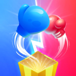

<p align="center">
    <a href="#">
        
    </a>
</p>
<p align="center">
    <a href="LICENSE">
        
    </a>
    <a href="#">
        
    </a>
    <a href="https://github.com/congcoi123/tenio/issues">
        
    </a>
    <a href="CONTRIBUTING.md">
        
    </a>
    <a href="https://discord.gg/ybkNU87Psy">
        
    </a>
</p>


# TenIO [](https://twitter.com/intent/tweet?text=TenIO%20is%20a%20java%20NIO%20based%20server%20specifically%20designed%20for%20multiplayer%20games.%0D%0A&url=https://github.com/congcoi123/tenio%0D%0A&hashtags=tenio,java,gameserver,multiplayer,nio,netty,jetty,msgpack,cocos2dx,unity,libgdx,phaserjs%0D%0A&via=congcoi123)
`TenIO` is an open-source project to create multiplayer online games that includes a java NIO (Non-blocking I/O) based server specifically designed for multiplayer games, which supports UDP, TCP, Websocket, HTTP transports, and available simple client projects for quick development.

## Features
- Scalable, distributed design
- Easy-to-use, OOP design
- Based on standard Java development, ensuring cross-platform support
- Simple event handlers implementation
- Simple physic simulator and debugger
- Have simple existing game clients for rapid development

## Showcases
| [<br /><sub><b>Game Box Online</b></sub>](https://www.youtube.com/watch?v=yLo2TRYd7Yw)<br />        | [<br /><sub><b>Gold Miner Online</b></sub>](https://www.youtube.com/watch?v=BBv5IQFHLjc)<br />        | [<br /><sub><b>Brick Game Online</b></sub>](https://www.youtube.com/watch?v=nojkJMAfG6Y)<br /> |
| :-----------------------------------------------------------------------------------------------------------------------------------------------------------------: | :-----------------------------------------------------------------------------------------------------------------------------------------------------------------: | :-----------------------------------------------------------------------------------------------------------------------------------------------------------------------: |

## First Glimpse
Simple Movement Simulation  


## Simple Implementation
- Establishes a simple server with only a single Java class

```Java
/**
 * This class shows how a simple server handle messages that came from a client.
 */
@Bootstrap
public final class TestSimpleServer {

  public static void main(String[] params) {
    ApplicationLauncher.run(TestSimpleServer.class, params);
  }

  /**
   * Create your own configurations.
   */
  @Setting
  public static class TestConfiguration extends CoreConfiguration implements Configuration {

    @Override
    protected void extend(Map<String, String> extProperties) {
      for (Map.Entry<String, String> entry : extProperties.entrySet()) {
        var paramName = entry.getKey();
        push(ExampleConfigurationType.getByValue(paramName), String.valueOf(entry.getValue()));
      }
    }
  }

  /**
   * Define your handlers.
   */

  @EventHandler
  public static class ConnectionEstablishedHandler extends AbstractHandler
      implements EventConnectionEstablishedResult<ZeroMap> {

    @Override
    public void handle(Session session, ZeroMap message, ConnectionEstablishedResult result) {
      if (result == ConnectionEstablishedResult.SUCCESS) {
        api().login(message.getString(SharedEventKey.KEY_PLAYER_LOGIN), session);
      }
    }
  }

  @EventHandler
  public static class PlayerLoggedInHandler extends AbstractHandler
      implements EventPlayerLoggedinResult<Player> {

    @Override
    public void handle(Player player, PlayerLoggedInResult result) {
      if (result == PlayerLoggedInResult.SUCCESS) {
        var parcel = map().putString(SharedEventKey.KEY_PLAYER_LOGIN,
            String.format("Welcome to server: %s", player.getName()));

        response().setContent(parcel.toBinary()).setRecipientPlayer(player).write();
      }
    }
  }

  @EventHandler
  public static class ReceivedMessageFromPlayerHandler extends AbstractHandler
      implements EventReceivedMessageFromPlayer<Player, ZeroMap> {

    @Override
    public void handle(Player player, ZeroMap message) {
      var parcel =
          map().putString(SharedEventKey.KEY_CLIENT_SERVER_ECHO, String.format("Echo(%s): %s",
              player.getName(),
              message.getString(SharedEventKey.KEY_CLIENT_SERVER_ECHO)));

      response().setContent(parcel.toBinary()).setRecipientPlayer(player).write();
    }
  }
}
```

- Supports self-defined commands to interact with the server conveniently
1) Usage
  
```text
2022-11-20 05:20:38,256 [main] INFO  com.tenio.core.server.ServerImpl - [SERVER][Example] Started
$ help
help - Shows all supporting commands
  [<command>,<command>,<command>]
info - Provides brief information about players and rooms on the server
  player
  room
player - Logout the first player from the server
  logout first
server - Allows stopping or restarting the server
  stop
  restart
unban - Allows removing banned Ip addresses from the ban list
  [<address>,<command>,<command>]
$ info player
> There are 1 players > The first 10 entities > [Player{name='IkjvI', properties={}, session=Session{id=0, name='IkjvI', transportType=TCP, createdTime=1668918078524, lastReadTime=1668918078524, lastWriteTime=1668918078524, lastActivityTime=1668918078524, readBytes=75, writtenBytes=120, droppedPackets=0, inactivatedTime=0, datagramRemoteSocketAddress=null, clientAddress='127.0.0.1', clientPort=60659, serverPort=8032, serverAddress='127.0.0.1', maxIdleTimeInSecond=0, activated=true, connected=true, hasUdp=false, enabledKcp=false, hasKcp=false}, currentRoom=null, state=null, roleInRoom=SPECTATOR, lastLoginTime=1668918078589, lastJoinedRoomTime=1668918078588, playerSlotInCurrentRoom=-1, loggedIn=true, activated=true, hasSession=true}]
$ 
```

2) Make sure to set the command usage flag in _**setting.json**_ file to be **enabled**

```JSON
{
  "command": {
    "enabled": true
  },
  "plugin": {
    "enabled": false,
    "path": "/plugin"
  }
}
``` 

3) Simple implementation
```Java
@Command(label = "player", usage = {
    "logout first"
}, description = "Logout the first player from the server")
public class PlayerCommand extends AbstractCommandHandler {

  @Override
  public void execute(List<String> args) {
    var action = args.get(0);
    var param = args.get(1);

    if (action.equals("logout") && param.equals("first")) {
      var players = api().getReadonlyPlayersList();
      if (players.isEmpty()) {
        CommandUtility.INSTANCE.showConsoleMessage("Empty list of players.");
        return;
      }
      var firstPlayer = players.get(0);
      CommandUtility.INSTANCE.showConsoleMessage("Player {" + firstPlayer.getName() + "} is " +
          "going to logout.");
      api().logout(firstPlayer);
    } else {
      CommandUtility.INSTANCE.showConsoleMessage("Invalid action.");
    }
  }
}
``` 

## Wiki
The [wiki](https://github.com/congcoi123/tenio/wiki) provides implementation level details and answers to general questions that a developer starting to use `TenIO` might have about it.

## Clients
| [<br /><sub><b>TenIO Cocos2dx</b></sub>](https://github.com/congcoi123/tenio-cocos2dx)<br />        | [<br /><sub><b>TenIO Libgdx</b></sub>](https://github.com/congcoi123/tenio-libgdx)<br /> | [<br /><sub><b>TenIO Unity</b></sub>](https://github.com/congcoi123/tenio-unity)<br />          | [<br /><sub><b>TenIO Phaserjs</b></sub>](https://github.com/congcoi123/tenio-phaserjs)<br /> |
| :-----------------------------------------------------------------------------------------------------------------------------------------------------------------: | :-----------------------------------------------------------------------------------------------------------------------------------------------------------------------: | :-------------------------------------------------------------------------------------------------------------------------------------------------------------------: | :-------------------------------------------------------------------------------------------------------------------------------------------------------------: |

## Framework
The project is strongly based on the same name framework as you can be referenced by the following repositories.
- [`tenio-common`](https://github.com/congcoi123/tenio-common.git)
- [`tenio-core`](https://github.com/congcoi123/tenio-core.git)
- [`tenio-engine`](https://github.com/congcoi123/tenio-engine.git)

## Requirements
```txt
- Java 17
```

## License
The `TenIO` project is currently available under the [MIT](LICENSE) License.

## Contributing
Please check out the [contributing guideline](CONTRIBUTING.md) for more details.

## Documentations
Please check out the [documentations directory](documentations) for more details.

## Installation
```sh
$ git clone https://github.com/congcoi123/tenio.git
```

## Examples
### Collection
Please check out [`this repository`](https://github.com/congcoi123/tenio-examples.git) for references.
### Wanna try Kotlin?
Then you should check out [`this showcase`](https://github.com/congcoi123/lonely-dragon.git) for more details.

> Happy coding !
